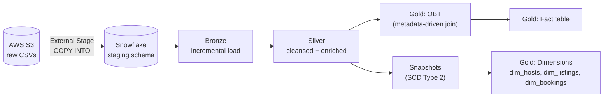

# Airbnb Analytics Pipeline — AWS S3 → Snowflake → dbt

An end-to-end analytics engineering pipeline that loads raw Airbnb booking, listing, and host data from **AWS S3** into **Snowflake**, then transforms it through a **Bronze → Silver → Gold medallion architecture** using **dbt**.

Built while following [Ansh Lamba's Airbnb End-to-End Data Engineering tutorial](https://www.youtube.com/watch?v=3SZSDKEZqoA), then extended with incremental models, a metadata-driven join layer, and SCD2 snapshots.

## Architecture



**Data flow:**
1. Raw `bookings`, `hosts`, and `listings` CSVs land in an S3 bucket.
2. A Snowflake **external stage** + `COPY INTO` loads them into the `staging` schema.
3. dbt picks it up from there and runs it through three layers:
   - **Bronze** — incremental, near-raw copies of the staging tables (watermarked on `CREATED_AT`).
   - **Silver** — cleansed and enriched: derived fields, fee calculations, and rate-quality bucketing via custom macros.
   - **Gold** — a metadata-driven "One Big Table" (OBT) and fact table built from a config-driven Jinja loop, plus dimension tables sourced from snapshots.
4. dbt **snapshots** track full history of hosts, listings, and bookings as **Type-2 slowly changing dimensions**.

## Tech Stack

| Layer | Tool |
|---|---|
| Storage | AWS S3 |
| Warehouse | Snowflake |
| Transformation | dbt-core, dbt-snowflake |
| Language | SQL, Jinja, Python 3.12 |
| Package management | [uv](https://github.com/astral-sh/uv) |

## Project Structure

```
aws_dbt_snowflake_project/
├── models/
│   ├── sources/        # source.yml — declares the staging tables
│   ├── bronze/         # incremental, lightly-typed raw copies
│   ├── silver/         # cleansed + business logic
│   └── gold/
│       ├── obt.sql          # metadata-driven One Big Table
│       ├── fact.sql         # fact table built from the OBT
│       └── ephemeral/       # CTE-only models split out of the OBT
├── snapshots/           # SCD Type 2 history for hosts, listings, bookings
├── macros/               # multiply(), tag(), generate_schema_name(), trimmer()
├── tests/                # custom source data tests
└── analyses/             # ad-hoc Jinja/SQL exploration
```

## Key Features

- **Incremental models** — Bronze and Silver layers use `is_incremental()` watermark filters and unique-key merge strategies, so re-runs only process new or changed rows.
- **Metadata-driven Gold layer** — `obt.sql` and `fact.sql` build their `SELECT`/`JOIN` clauses from a Jinja-templated list of table configs rather than hardcoded SQL, making it easy to add new sources.
- **Custom macros** — reusable logic for rounding/fee calculations (`multiply`), value-based categorization (`tag`), schema routing (`generate_schema_name`), and string cleanup (`trimmer`).
- **SCD Type 2 snapshots** — `dim_hosts`, `dim_listings`, and `dim_bookings` preserve full historical change records using dbt's timestamp snapshot strategy.
- **Source data tests** — a custom singular test flags bookings with suspiciously low amounts.

## Setup

### 1. Install dependencies

```bash
uv sync
```

### 2. Configure Snowflake credentials

This project expects a `profiles.yml`. **Do not commit real credentials to the repo.** The recommended setup is to keep `profiles.yml` outside the project, in `~/.dbt/profiles.yml`, and reference secrets via environment variables:

```yaml
aws_dbt_snowflake_project:
  target: dev
  outputs:
    dev:
      type: snowflake
      account: "{{ env_var('SNOWFLAKE_ACCOUNT') }}"
      user: "{{ env_var('SNOWFLAKE_USER') }}"
      password: "{{ env_var('SNOWFLAKE_PASSWORD') }}"
      role: "{{ env_var('SNOWFLAKE_ROLE') }}"
      database: AIRBNB
      warehouse: COMPUTE_WH
      schema: dbt_schema
      threads: 1
```

Then export the variables before running dbt:

```bash
export SNOWFLAKE_ACCOUNT=your_account_locator
export SNOWFLAKE_USER=your_username
export SNOWFLAKE_PASSWORD=your_password
export SNOWFLAKE_ROLE=your_role
```

### 3. Load raw data into Snowflake

Create an external stage pointing at your S3 bucket and `COPY INTO` the `staging.bookings`, `staging.hosts`, and `staging.listings` tables before running dbt.

### 4. Run the pipeline

```bash
cd aws_dbt_snowflake_project
dbt run          # build bronze → silver → gold
dbt snapshot      # capture SCD2 history
dbt test          # run source/data tests
```

## Roadmap

- [ ] Orchestrate the S3 load + dbt run with Airflow
- [ ] Add dbt unit tests for macro logic
- [ ] Add a BI layer (e.g., a simple dashboard) on top of the Gold fact table

## Credits

Built while following [Ansh Lamba's Airbnb End-to-End Data Engineering Project tutorial](https://www.youtube.com/watch?v=3SZSDKEZqoA), with additional incremental loading, metadata-driven joins, and SCD2 snapshot logic added on top.
